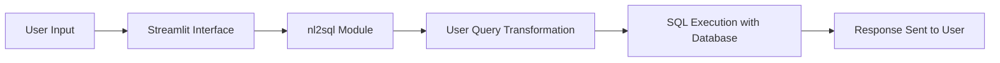

# nl2sql-insight-chatbot

 

## Overview

The `nl2sql-insight-chatbot` is an innovative chatbot application that transforms natural language queries into SQL statements, leveraging the Northwind database for backend data processing. The app is built utilizing advanced AI models for natural language processing, enabling efficient data retrieval through a user-friendly chat interface powered by Streamlit.

---

## Features & Functionality

- **Natural Language Understanding**: Converts user queries into SQL syntax.
- **Interactive User Interface**: Streamlit allows for a responsive chat-like interaction with users.
- **Predefined Queries**: Access to common SQL queries for enhanced functionality.
- **Database Connectivity**: Seamless integration with the SQLite Northwind database.

---

## Technology Stack

- **Programming Language**: Python 3.8+
- **Frameworks and Libraries**:
  - Streamlit: For interactive front-end application.
  - Google GenAI: For enhanced language model capabilities.
  - NumPy and Pandas: For effective data handling and manipulation.
  - TQDM: For progress indication in data processing.
- **Database**: SQLite using `northwind.db`.

---

## Repository Structure

```plaintext
nl2sql-insight-chatbot/
├── app.py
├── nl2sql/
│   ├── answerer.py
│   ├── config.py
│   ├── executor.py
│   ├── llm.py
│   └── pipeline.py
├── data/
│   └── northwind.db
├── queries/
├── .env.example
├── requirements.txt
├── pyproject.toml
└── test_guardrails.py
```

---

## System Architecture & Application Workflow



---

## Installation & Setup Instructions

1. **Clone the Repository**:
   ```bash
   git clone https://github.com/abhisingh007224/nl2sql-insight-chatbot.git
   cd nl2sql-insight-chatbot
   ```

2. **Create a Virtual Environment**:
   ```bash
   python -m venv venv
   source venv/bin/activate
   ```

3. **Install Dependencies**:
   ```bash
   pip install -r requirements.txt
   ```

4. **Set Up Environment Variables**:
   - Copy `.env.example` to `.env` and set your `GEMINII_API_KEY`.

5. **Run the Application**:
   ```bash
   streamlit run app.py
   ```

---

## Environment/Configuration Requirements

- **Environment Variables**:
  - `GEMINII_API_KEY`: Your API key for Google GenAI services.

**Example `.env` Content**:
```plaintext
GEMINII_API_KEY=your-geminii-api-key-here
```

---

## API Documentation

The application interfaces with the user through a Streamlit web interface, primarily managed in `app.py`. User queries are processed and converted to SQL using various functions within the `nl2sql` module.

---

## Database/Schema Information

The app utilizes the `northwind.db` SQLite database, which includes essential tables like:
- `Orders`
- `Customers`
- `Products`

---

## Important Classes, Functions, and Modules

- **`app.py`**: Entry point for managing user interactions.
- **`nl2sql/answerer.py`**: Core logic for translating natural language into SQL queries.
- **`nl2sql/config.py`**: Configuration and settings handling.
- **`nl2sql/executor.py`**: Executes the generated SQL queries.
- **`nl2sql/llm.py`**: Manages interactions with language models.
- **`nl2sql/pipeline.py`**: Orchestrates the data processing and query generation flow.

---

## Code Execution Flow

1. User inputs a natural language query via the Streamlit interface.
2. The input is passed to the `nl2sql/answerer.py` file for translation into SQL.
3. The SQL query is executed against the `northwind.db` database using `nl2sql/executor.py`.
4. The results are returned and displayed back to the user.

---

## Testing Instructions

To run unit tests on the application, use:
```bash
python -m unittest discover -s tests
```

---

## Deployment Instructions

- **Local Deployment**: The application is set up for local execution. To deploy in a production environment, consider using Docker for containerization and cloud platforms for enhanced scalability.

---

## Troubleshooting & Common Issues

- **Environment Variables**: Ensure that all required environment variables are correctly set, especially `GEMINII_API_KEY`.
- **Database Connectivity**: Verify that the database schema matches the expected structure if query execution fails.

---

## Usage Examples

Here’s an example of how to interact with the chatbot:
```plaintext
User: "Show me all orders from last month."
Bot: "Executing SQL query to retrieve the necessary information..."
```

---

## Contributing

We welcome contributions to enhance the functionality and performance of the `nl2sql-insight-chatbot`. Please follow standard contribution guidelines (TBD).

---

## License

This project is licensed under the MIT License (TBD).