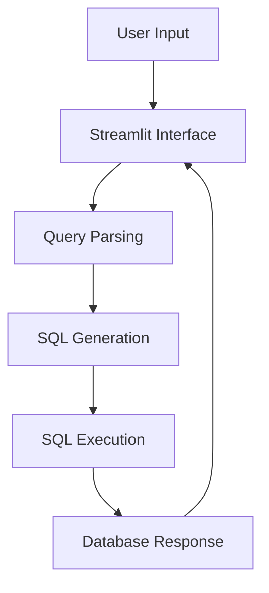

# nl2sql-insight-chatbot


## Overview

`nl2sql-insight-chatbot` is a powerful chatbot application that translates natural language queries into SQL statements, leveraging the Northwind database. It integrates advanced AI models for natural language processing and database interaction, providing insightful data retrieval through an intuitive chat interface built with Streamlit.

## Features & Functionality

- **Natural Language Parsing**: Translates user queries from natural language to SQL.
- **SQL Execution**: Directly executes generated SQL on a local SQLite database.
- **AI Integration**: Utilizes Google GenAI services for enhanced language understanding.
- **Embeddings and Indexing**: Enhances query accuracy and relevance.
- **Testing Suite**: Includes tests to ensure the functionality of key modules and components.

## Technology Stack

- **Programming Language**: Python 3.8+
- **Libraries/Frameworks**:
  - [Streamlit](https://streamlit.io/)
  - [Google GenAI](https://cloud.google.com/genai)
  - [Numpy](https://numpy.org/)
  - [Pandas](https://pandas.pydata.org/)
  - [Torch](https://pytorch.org/)
- **Database**: SQLite

## Repository Structure

```
nl2sql-insight-chatbot
├── .env.example
├── app.py
├── requirements.txt
├── pyproject.toml
├── nl2sql
│   ├── answerer.py
│   ├── config.py
│   ├── executor.py
│   ├── guardrails.py
│   └── pipeline.py
├── Data/
│   └── pre-trained models and indices...
├── tests/
│   └── test_guardrails.py
└── README.md
```

## System Architecture & Application Workflow

The architecture leverages a modular design where different components interact through a unified interface. The application processes input through a web interface, generates SQL queries, and executes them, returning results to the user.



## Installation & Setup Instructions

1. **Clone the Repository**:
   ```bash
   git clone https://github.com/abhisingh007224/nl2sql-insight-chatbot.git
   cd nl2sql-insight-chatbot
   ```

2. **Create a Virtual Environment** (optional but recommended):
   ```bash
   python -m venv venv
   source venv/bin/activate  # On Windows use `venv\Scripts\activate`
   ```

3. **Install Dependencies**:
   ```bash
   pip install -r requirements.txt
   ```

4. **Set Up Environment Variables**:
   - Copy `.env.example` to a new file named `.env`:
     ```bash
     cp .env.example .env
     ```
   - Fill in the `GEMINII_API_KEY` with your key obtained from [Google AI Studio](https://aistudio.google.com/apikey).

5. **Run the Application**:
   ```bash
   streamlit run app.py
   ```

## Environment/Configuration Requirements

- **Environment Variables**:
  - `GEMINII_API_KEY`: Your API key for Google GenAI services.
  
  Sample `.env` Content:
  ```plaintext
  GEMINII_API_KEY=your-gemini-api-key-here
  ```

## API Documentation

The application processes inputs through its Streamlit interface. The primary entry point is through `app.py`, where user queries are captured and processed using the `nl2sql` module.

### Endpoints

- **Query Processing**: 
  - Method: `POST`
  - URL: `/ask`
  - Request Body: `{ "query": "<your natural language query>" }`
  - Response: `{ "sql": "<generated SQL>", "result": "<query result>" }`

## Database/Schema Information

The application uses the SQLite database `northwind.db`, which includes tables such as:
- **Orders**
- **Customers**
- **Products**

## Important Classes, Functions, and Modules

- **`app.py`**: The main application script handling user interactions.
- **`config.py`**: Manages configuration settings and environment variables.
- **`executor.py`**: Executes SQL queries on the database.
- **`guardrails.py`**: Contains functionalities for input validation and error handling.

## Code Execution Flow

1. User inputs a query via the Streamlit interface.
2. The input is processed and validated.
3. The application generates the corresponding SQL using the `nl2sql` module.
4. The SQL is executed against the SQLite database.
5. Results are fetched and displayed back to the user.

## Testing Instructions

To run the tests, execute the following command:
```bash
python -m unittest discover -s tests
```

## Deployment Instructions

Currently, this application is intended for local development. To deploy in a production environment:
1. Containerize the application using Docker (your choice) to ensure consistency.
2. Use a cloud provider (AWS, GCP, etc.) if deploying as a service.

## Troubleshooting & Common Issues

- Ensure all environment variables are correctly set.
- Validate the API key and internet connection when using Google GenAI.
- Check your SQLite schema against the expected structure if queries fail.

## Usage Examples

```python
# Example of executing a query using the app interface
query = "Show me all products sold in 1996."
response = requests.post("http://localhost:8501/ask", json={"query": query})
print(response.json())
```

## Contributing

We welcome contributions! Please read our contributing guidelines (TBD) for details on how to get involved.

## License

This project is licensed under the MIT License. See the [LICENSE](LICENSE) file for more information.
